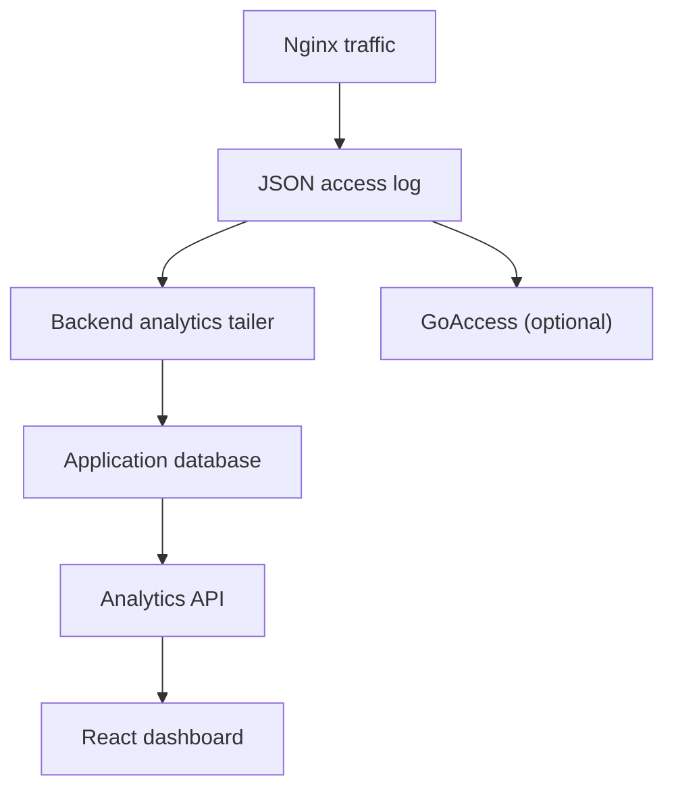

# Advanced Analytics

ShieldPM includes a built-in traffic dashboard. The backend parses local Nginx JSON access logs and stores request details and aggregates in the configured application database. Request details include client IPs, paths and user agents; treat that database and its backups as sensitive.

---

## 🏗️ Architecture



---

## Key Features

- **Traffic Overview:** displays recently ingested request counts and the live network throughput of the server. Aggregates flush approximately every 10 seconds.
- **Requests Over Time:** Area chart showing traffic trends over the last 1h, 24h, 7d, or 30d.
- **Status Codes:** Bar chart breakdown of HTTP response codes (2xx, 3xx, 4xx, 5xx).
- **Top Lists:**
  - **Countries:** GeoIP-based breakdown of traffic sources.
  - **IPs:** Most frequent client IP addresses.
  - **Referrers:** Top domains linking to your services.
  - **Paths:** Most requested URL paths.
  - **User Agents:** Breakdown of browsers and devices.
- **Recent Requests:** Detailed table of the latest requests with method, status, path, IP, and duration.
- **Database Statistics:** engine-dependent metrics including:
  - **Database Size:** Current size of the application database.
  - **Engine Type:** Shows SQLite, MySQL, or PostgreSQL.
  - **Connections:** Number of active database connections.
  - **Read/Write I/O:** Cumulative read and write operations:
    - **SQLite:** Attempts `PRAGMA cache_stats`; when unavailable, I/O counters remain zero.
    - **MySQL:** Uses `Handler_read_rnd_next` and `Handler_write` status variables.
    - **PostgreSQL:** Uses `blks_read`, `blks_hit`, and tuple statistics from `pg_stat_database`.

## Privacy

The built-in analytics service does not need a third-party analytics provider. It stores IP addresses and other request details locally. By default, detailed database rows are deleted after 24 hours and minute aggregates after 35 days; the retention job runs on startup and hourly. Set `ANALYTICS_DETAILED_RETENTION_HOURS` and `ANALYTICS_AGGREGATION_RETENTION_DAYS` to change those periods. Nginx log-file rotation is a separate mechanism. GoAccess can be configured independently with its own `GOACLA` options, including IP anonymization.

## Configuration

Built-in analytics are enabled by default. GoAccess is **off** by default (`GOA=false`); enable it with `GOA=true` to use its separate dashboard on `GOA_PORT` (default `91`). Per-host analytics is limited to hosts the user can view according to server-side permission checks; global analytics requires the `analytics:list` permission.

### Enabling GeoIP (Country Statistics)

ShieldPM prepares `GeoLite2-Country.mmdb`, `GeoLite2-City.mmdb`, and `GeoLite2-ASN.mmdb` in `/data/nginx` automatically before services start. The default `GEOIP_AUTO_UPDATE=true` checks the [latest GeoLite.mmdb release](https://github.com/shedowe19/GeoLite.mmdb/releases/latest) on the first start and every later start. This needs no MaxMind account, license key, or separate updater container.

Files already matching the release's size, SHA-256 digest, and database validation are reused. New files are staged and all three databases verified before replacement: the native MMDB reader must open each file with the expected database type and format. If downloading or verification fails, a complete valid previous cache permits startup with a warning; without that cache, startup stops before services run. Unsafe destination paths, another running updater, or incomplete recovery also stop startup. Automatic updates run during startup.

Downloading the files is independent of module activation. To use country statistics and the firewall's country/ASN lookups, enable the GeoIP2 module.

#### 1. Enable the Nginx module

```yaml
# Docker (compose.yaml)
environment:
  - "GEOIP_AUTO_UPDATE=true" # default; prepares all three databases at startup
  - "NGINX_LOAD_GEOIP2_MODULE=true"
```

```bash
# Native / LXC (/data/.env)
GEOIP_AUTO_UPDATE=true
NGINX_LOAD_GEOIP2_MODULE=true
```

#### 2. Restart ShieldPM

```bash
# Docker
docker compose up -d

# Native / LXC
systemctl restart shieldpm
```

Once started, Nginx uses the prepared databases and new requests can include country and ASN information. With `GOA=true`, GoAccess also discovers City, Country, and ASN files in `/data/nginx` at startup. For each database, an existing non-empty file in `/data/goaccess/geoip` takes precedence. An explicit `--geoip-database` setting in `GOACLA` disables this automatic discovery.

### Offline or custom GeoIP data

Set **`GEOIP_AUTO_UPDATE=false`** in the ShieldPM environment to disable the automatic GitHub release check and downloads. Use this for offline installations or databases maintained through your own MaxMind updater. Provide the files required by active Nginx GeoIP blocks in `/data/nginx`; module activation remains a separate setting.

**Docker with a custom MaxMind updater:** Keep `GEOIP_AUTO_UPDATE=false` on the ShieldPM service and configure the optional sidecar with your own [MaxMind account](https://www.maxmind.com/en/geolite2/signup):

```yaml
geoipupdate:
  container_name: shieldpm-geoipupdate
  image: ghcr.io/maxmind/geoipupdate:latest
  restart: always
  network_mode: bridge
  environment:
    - "TZ=Europe/Berlin"
    - "GEOIPUPDATE_EDITION_IDS=GeoLite2-Country GeoLite2-City GeoLite2-ASN"
    - "GEOIPUPDATE_ACCOUNT_ID=<your-account-id>"
    - "GEOIPUPDATE_LICENSE_KEY=<your-license-key>"
    - "GEOIPUPDATE_FREQUENCY=24"
  volumes:
    - "/opt/shieldpm/nginx:/usr/share/GeoIP"
```

> [!IMPORTANT]
> The volume path must be `/opt/shieldpm/nginx` on the host side, as this maps to `/data/nginx` inside the ShieldPM container, which is where Nginx expects the files.

**Native / LXC with a custom MaxMind updater:** Set `GEOIP_AUTO_UPDATE=false` in `/data/.env`, then configure your own updater:

```bash
apt install -y geoipupdate
cat > /etc/GeoIP.conf << EOF
AccountID <your-account-id>
LicenseKey <your-license-key>
EditionIDs GeoLite2-Country GeoLite2-City GeoLite2-ASN
DatabaseDirectory /data/nginx
EOF
chmod 600 /etc/GeoIP.conf
geoipupdate
# Setup weekly cron
echo "0 3 * * 3 root /usr/bin/geoipupdate > /dev/null 2>&1" > /etc/cron.d/geoipupdate
```

Enable `NGINX_LOAD_GEOIP2_MODULE=true` and restart ShieldPM after first providing the custom databases. Existing independently configured updater services or cron jobs remain your responsibility; automatic startup downloads are disabled by the opt-out.

### ASN data for the IP Firewall

The [IP Firewall](./IP-Firewall.md#block-autonomous-systems-for-a-host) uses the same automatically prepared `GeoLite2-ASN.mmdb` to show the visitor network and apply per-host ASN rules. Keep `NGINX_LOAD_GEOIP2_MODULE=true`. For a custom updater, include `GeoLite2-ASN` in its editions. The firewall startup configuration uses `/data/nginx/GeoLite2-ASN.mmdb`; a file available only to GoAccess under `/data/goaccess/geoip` does not configure this Nginx lookup.

Keep the Country/City databases referenced by existing active Analytics blocks available. Their configuration and the existing GoAccess discovery remain unchanged. ASN data does not provide country codes, and this integration adds no ASN chart to the Analytics dashboard.

## Related pages

- [IP Firewall](./IP-Firewall.md)
- [Configuration](./Configuration.md)
- [Docker Compose reference](./Docker-Compose-Reference.md)
