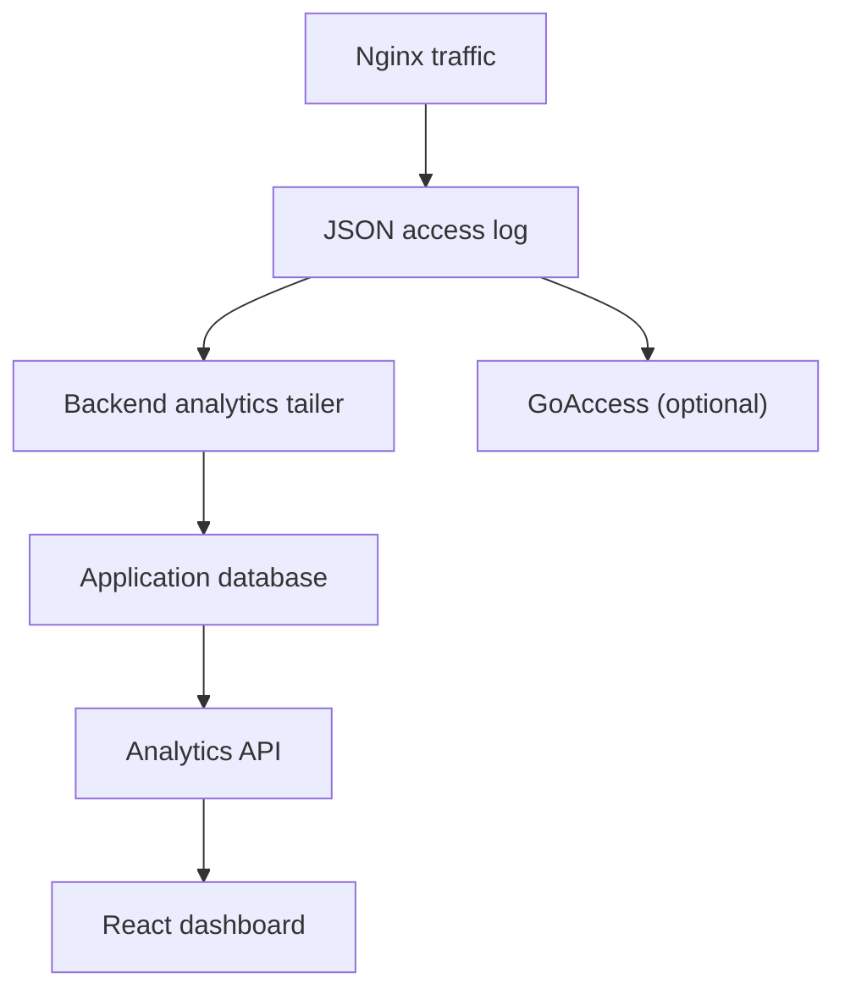

# Advanced Analytics

ShieldPM includes a built-in traffic dashboard. The backend parses local Nginx JSON access logs and stores request details and aggregates in the configured application database. Request details include client IPs, paths and user agents; treat that database and its backups as sensitive.

---

## 🏗️ Architecture



---

## Key Features

- **Traffic Overview:** displays recently ingested request counts and the live network throughput of the server. Aggregates flush approximately every 10 seconds.
- **Requests Over Time:** Area chart showing traffic trends over the last 1h, 24h, 7d, or 30d.
- **Status Codes:** Bar chart breakdown of HTTP response codes (2xx, 3xx, 4xx, 5xx).
- **Top Lists:**
  - **Countries:** GeoIP-based breakdown of traffic sources.
  - **IPs:** Most frequent client IP addresses.
  - **Referrers:** Top domains linking to your services.
  - **Paths:** Most requested URL paths.
  - **User Agents:** Breakdown of browsers and devices.
- **Recent Requests:** Detailed table of the latest requests with method, status, path, IP, and duration.
- **Database Statistics:** engine-dependent metrics including:
  - **Database Size:** Current size of the application database.
  - **Engine Type:** Shows SQLite, MySQL, or PostgreSQL.
  - **Connections:** Number of active database connections.
  - **Read/Write I/O:** Cumulative read and write operations:
    - **SQLite:** Attempts `PRAGMA cache_stats`; when unavailable, I/O counters remain zero.
    - **MySQL:** Uses `Handler_read_rnd_next` and `Handler_write` status variables.
    - **PostgreSQL:** Uses `blks_read`, `blks_hit`, and tuple statistics from `pg_stat_database`.

## Privacy

The built-in analytics service does not need a third-party analytics provider. It stores IP addresses and other request details locally. By default, detailed database rows are deleted after 24 hours and minute aggregates after 35 days; the retention job runs on startup and hourly. Set `ANALYTICS_DETAILED_RETENTION_HOURS` and `ANALYTICS_AGGREGATION_RETENTION_DAYS` to change those periods. Nginx log-file rotation is a separate mechanism. GoAccess can be configured independently with its own `GOACLA` options, including IP anonymization.

## Configuration

Built-in analytics are enabled by default. GoAccess is **off** by default (`GOA=false`); enable it with `GOA=true` to use its separate dashboard on `GOA_PORT` (default `91`). Per-host analytics is limited to hosts the user can view according to server-side permission checks; global analytics requires the `analytics:list` permission.

### Enabling GeoIP (Country Statistics)

To enable the country breakdown in the analytics dashboard, you need to provide MaxMind GeoIP databases and enable the Nginx module.

#### 1. Configure GeoIP Update

**🐳 Docker:** Uncomment the `geoipupdate` service in your `compose.yaml`. You will need a free account from [MaxMind](https://www.maxmind.com/en/geolite2/signup).

```yaml
geoipupdate:
  container_name: shieldpm-geoipupdate
  image: ghcr.io/maxmind/geoipupdate:latest
  restart: always
  network_mode: bridge
  environment:
    - "TZ=Europe/Berlin"
    - "GEOIPUPDATE_EDITION_IDS=GeoLite2-Country GeoLite2-City" # GeoLite2-ASN is optional
    - "GEOIPUPDATE_ACCOUNT_ID=<your-account-id>"
    - "GEOIPUPDATE_LICENSE_KEY=<your-license-key>"
    - "GEOIPUPDATE_FREQUENCY=24"
  volumes:
    - "/opt/shieldpm/nginx:/usr/share/GeoIP"
```

> [!IMPORTANT]
> The volume path must be `/opt/shieldpm/nginx` on the host side, as this maps to `/data/nginx` inside the ShieldPM container, which is where Nginx expects the files.

**📦 Native / LXC:** The installer offers GeoIP as an optional step (`Install GeoIP Update? [y/N]`). For manual setup:

```bash
apt install -y geoipupdate
cat > /etc/GeoIP.conf << EOF
AccountID <your-account-id>
LicenseKey <your-license-key>
EditionIDs GeoLite2-Country GeoLite2-City GeoLite2-ASN
DatabaseDirectory /data/nginx
EOF
geoipupdate
# Setup weekly cron
echo "0 3 * * 3 root /usr/bin/geoipupdate > /dev/null 2>&1" > /etc/cron.d/geoipupdate
```

#### 2. Enable Nginx Module

Set `NGINX_LOAD_GEOIP2_MODULE=true`:

```yaml
# Docker (compose.yaml)
environment:
  - "NGINX_LOAD_GEOIP2_MODULE=true"
```

```bash
# Native / LXC (/data/.env)
NGINX_LOAD_GEOIP2_MODULE=true
```

#### 3. Restart

```bash
# Docker
docker compose up -d

# Native / LXC
systemctl restart shieldpm
```

Once restarted, Nginx will load the GeoIP database, and new requests will be tagged with their country code.

With `GOA=true`, GoAccess also discovers the City, Country, and ASN databases in `/data/nginx` at startup. For each database, an existing non-empty file in `/data/goaccess/geoip` takes precedence. An explicit `--geoip-database` setting in `GOACLA` disables this automatic discovery.
